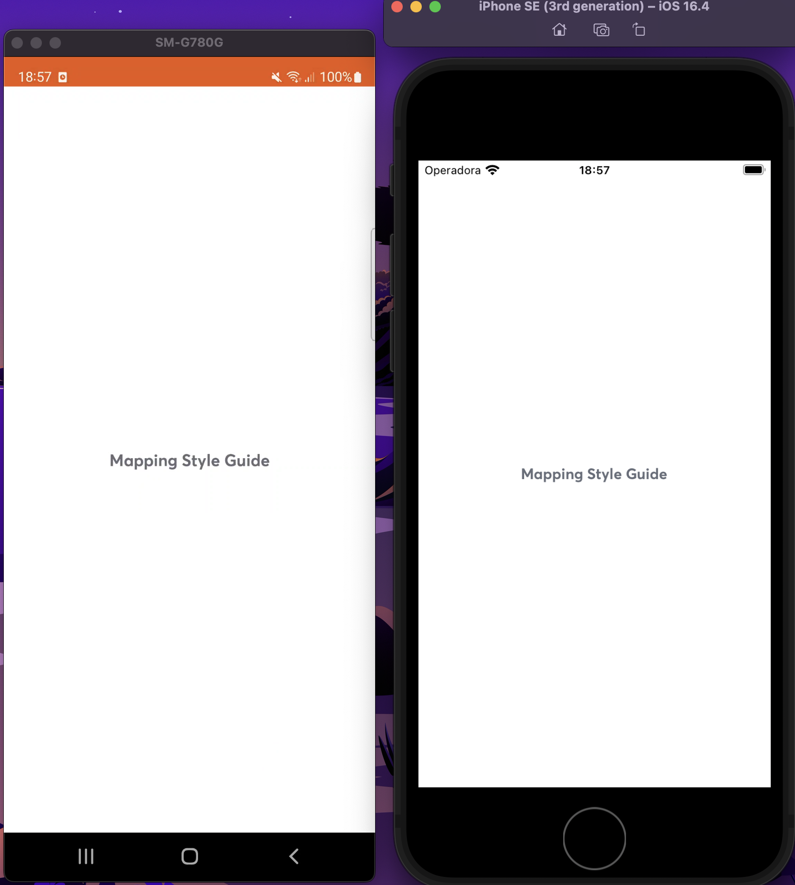
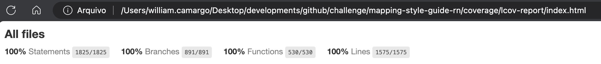

# mapping-style-guide-rn

O `mapping-style-guide-rn` é o repositório responsável por centralizar os componentes do Design System utilizado no SuperApp. Também centraliza qualquer componente que esteja relacionado à estilo, como hooks e providers de tema, sem conter regras de negócio.

### Dependências com configuração
* [Expo Modules](https://docs.expo.dev/bare/installing-expo-modules/) responsável por permitir adicionar libs que compõem o desenvolvimento dos módulos.
* Para instalar as fonts (android e ios), execute: npx react-native-asset

## Aplicação em tempo real (Android / iOS)

## Cobertura do código

